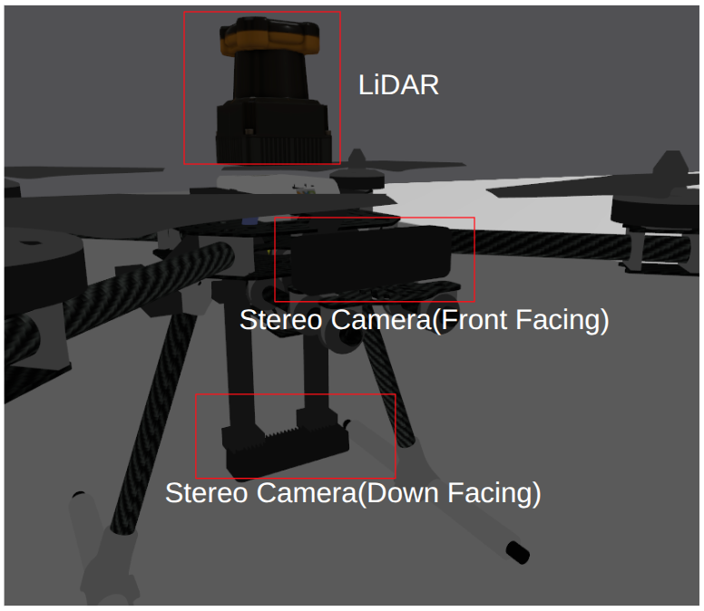
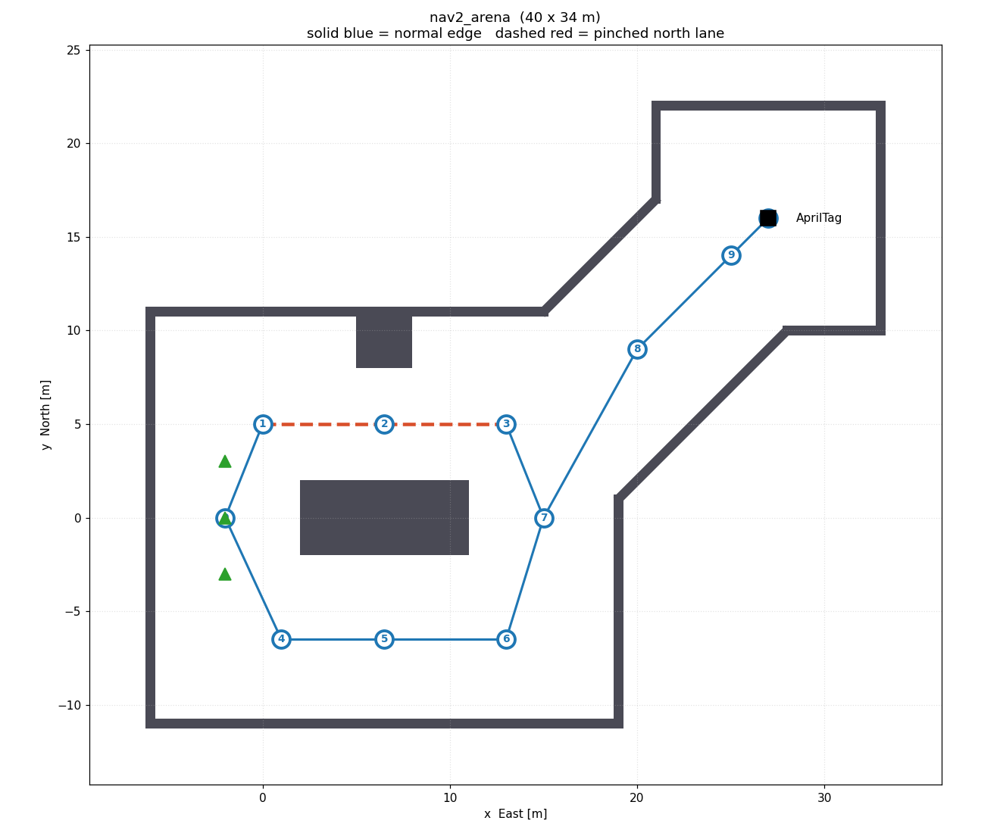
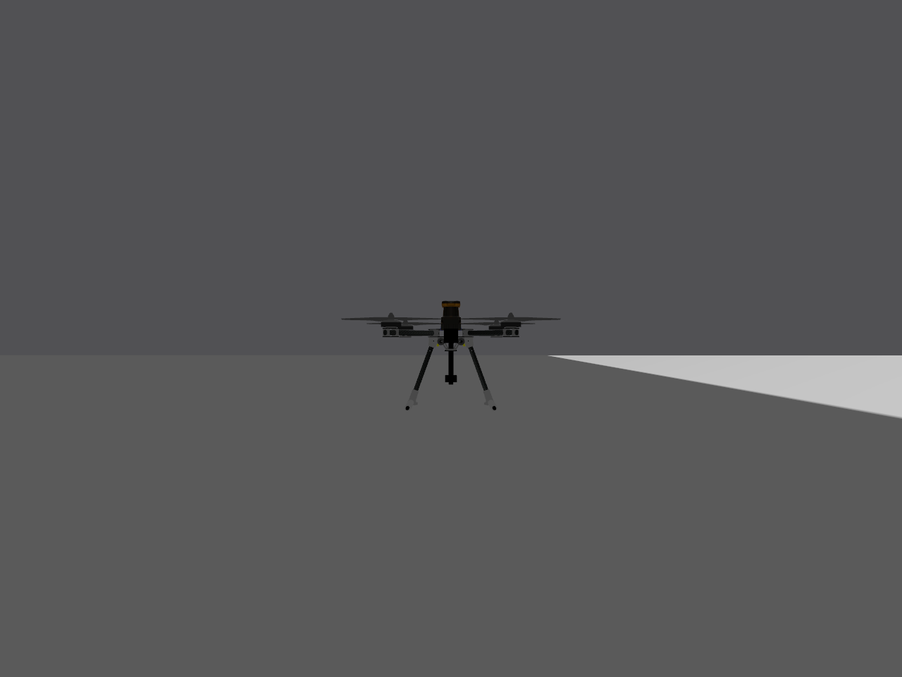

# drone_nav2_apriltag — Gazebo 導航場地 + nav2_route 拓樸地圖

## 最新修改：x500_depth_nav2 RGB-D / RTAB-Map 前置整合

這個分支新增 `x500_depth_nav2`，以 PX4 內建 `x500_depth` 為基礎：保留前視 `OakD-Lite` 深度相機，再額外加入朝下 `OakD-Lite` 與 2D lidar。啟動時預設模型已切成：



```bash
SIM_MODEL=x500_depth_nav2
```

`launch/cameras.launch.py` 也已改成橋接新模型的 RGB-D / lidar topics：

```text
/MAV1/camera_front/rgb/image_raw
/MAV1/camera_front/rgb/camera_info
/MAV1/camera_front/depth/image_raw
/MAV1/camera_front/depth/camera_info
/MAV1/camera_front/depth/points
/MAV1/camera_down/rgb/image_raw
/MAV1/camera_down/rgb/camera_info
/MAV1/camera_down/depth/image_raw
/MAV1/camera_down/depth/camera_info
/MAV1/camera_down/depth/points
/MAV1/scan
```

同時發布 sensor mount 的 static TF：

```text
base_link -> camera_link
base_link -> camera_down_link
base_link -> lidar_link
```

RTAB-Map 還需要動態 `odom -> base_link`。這段不要用 SDF/static TF 假造，應該由 PX4 `/MAV1/fmu/out/vehicle_odometry` 轉出，或由 RTAB-Map 的 RGB-D odometry 產生。

---

ROS 2 Humble + PX4 SITL 的**場地與地圖套件**。
提供一個只有高牆的 Gazebo 場地、一張對應的 `nav2_route` 拓樸圖，
以及三層可以獨立執行的驗證工具（靜態檢查 / RViz 疊圖 / 實飛）。

> 這個 repo **本身就是一個 ROS 2 package**，不是 workspace。
> clone 進你既有 workspace 的 `src/` 底下即可。



---

## 快速導覽

| 你想知道 | 看哪一節 |
|---|---|
| 這包在做什麼、跟 Nav2 的關係 | [1 這包在做什麼](#1-這包在做什麼) |
| 場地長怎樣、尺寸為什麼是這樣 | [2 場地設計](#2-場地設計) |
| 拓樸地圖是什麼、怎麼決定路線 | [3 拓樸地圖](#3-拓樸地圖) |
| 怎麼證明這張地圖是對的 | [4 三層驗證 T1 T2 T3](#4-三層驗證-t1-t2-t3) |
| **我要在自己電腦上跑一次** | [5 在自己電腦上驗證](#5-在自己電腦上驗證) |
| 無人機身上有哪些感測器 | [6 機體 x500_nav2](#6-機體-x500_nav2) |
| **飛行途中要看到相機畫面** | [飛行途中看兩顆相機的畫面](#飛行途中看兩顆相機的畫面) |
| 檔案在哪、改地圖要動哪個檔 | [7 檔案結構](#7-檔案結構) |
| 有什麼坑 | [8 踩過的雷](#8-踩過的雷) |

---

## 1 這包在做什麼

- **目標**：讓無人機在 Gazebo 裡用 Nav2 導航繞過障礙物，掃到 AprilTag 就降落，最終三機編隊。
- **這包負責的部分**：**場地** + **拓樸地圖** + **自我驗證工具**。
- **這包不負責的部分**（由專案其他人做）：
  - `px4_tf_node`：NED→ENU、發布 `map → odom → base_link`
  - `cmd_vel_to_px4_node`：`geometry_msgs/Twist` → `TrajectorySetpoint`
  - Nav2 定高飛行 + 2D costmap
  - AprilTag 偵測與降落
- **設計原則**：這包的驗證工具**完全不依賴上面那些**。地圖對不對，不用等別人做完才知道。

### 環境版本（已驗證可用的組合）

| 項目 | 版本 |
|---|---|
| Ubuntu | 22.04 |
| ROS 2 | Humble |
| PX4-Autopilot（SITL） | v1.17.0 |
| Gazebo | Harmonic 8.15.0 |
| `nav2_route` | 1.1.20（Humble 的 debian 有，不用自己編） |
| `apriltag_ros` | 3.4.0 |

---

## 2 場地設計

`gz/worlds/nav2_arena.sdf` — **40 × 34 m**，12 面牆。

### 路線

```
起飛區 A ─┬─ 北道（被 pinch 夾成 6 m）─┐
          │                            ├─ 匯合 M ─ 斜走廊 C（45°）─ 空地 D ★
          └─ 南道（全寬 9 m）──────────┘
```

★ = AprilTag 36h11，貼在空地正中央 `(27, 16)` 的地面上。

### 幾個刻意的決定

- **所有障礙物都是 15 m 高的牆。**
  不放矮的、可飛越的東西 —— 「從上面飛過去」是地圖設計上的取巧，不是真的 3D 避障。
- **通道寬度由編隊決定，不是由美觀決定。**
  三角編隊外接圓半徑 2 m → 跨距 4 m → 加機身約 4.5 m → 再加 Nav2 costmap 膨脹層左右各 2 m
  → **主通道 9 m**。
- **起點到終點刻意有兩條路。**
  只有一條路的話 `route_server` 沒得選，拓樸圖就等於一張沒有選擇的清單。
- **兩條路的條件刻意不同**（北道被 `pinch_north` 夾到 6 m）。
  條件完全一樣的話，選哪條就變成擲骰子，展示不出「它為什麼這樣選」。
- **divider 東端只到 x=11**，刻意不伸到匯合區，免得擋住轉進斜走廊的路。
- **北道的三個節點壓在 y=5 而不是走廊中線 y=6.5** —— pinch 是從北牆往下長的，
  路線貼著南側走才閃得開。放中線的話離 pinch 只剩 2.500 m（T1 抓到的）。

### 座標系

- 世界是 **ENU**（x 東、y 北、z 上），見 world 檔裡的 `<world_frame_orientation>`。
- PX4 內部是 **NED**（x 北、y 東、z 下）。**前兩軸對調**，寫任何座標前先確認自己在哪個系統。

---

## 3 拓樸地圖

`graphs/nav2_arena.geojson` — **11 節點 / 22 條有向邊**，`nav2_route` 的 GeoJSON 格式。

### 拓樸圖 vs 一般地圖

- **一般地圖（costmap）**：把空間切成 5 cm 的格子，逐格搜尋。
- **拓樸圖**：一張圖（graph）。節點 = 有意義的地點，邊 = 「這兩點之間可以直接飛」。
- **兩者不是二選一**：`route_server` 規劃「經過哪些節點」，每一段再交給原本的 planner 用 costmap 閃障礙。

### 格式

- `Point` feature = 節點（`id` / `frame` / `coordinates`）
- `MultiLineString` feature = 邊（`id` / `startid` / `endid` / `cost` / `metadata` / `operations`）
- 邊是**有向的**，雙向通行要寫兩筆
- 邊的 `operations` 支援 `ON_ENTER` / `ON_EXIT`，節點支援 `NODE` ——
  「飛到這個節點開始掃 AprilTag」可以寫在地圖裡而不用改程式

### 路線是怎麼決定的

- **`route_server` 在起飛前一次算完整條路線**，不是飛到每個節點才決定下一步。
- 成本來源（兩個都要在 `route_server` 參數裡明寫，見 [7 踩過的雷](#8-踩過的雷)）：
  - `DistanceScorer` 讀 metadata 的 `speed_limit`：成本 = 距離 ÷ 速限
  - `PenaltyScorer` 讀 metadata 的 `penalty`：成本 += penalty
- 本圖給北道 `speed_limit: 0.5` + `penalty: 20`，所以預設會選南道。

實測幾個查詢：

| 查詢 | 結果 | cost |
|---|---|---|
| `0 → 10` | `0 4 5 6 7 8 9 10`（南道） | 46.15 |
| `7 → 10` | `7 8 9 10` | 20.20 |
| `3 → 10` | `3 7 8 9 10` | 25.58 |
| `0 → 3` | `0 4 5 6 7 3` | **31.34** |

最後一個特別有意思：`0 → 3` **走南道繞遠再從節點 7 倒回節點 3**，
因為北道直達要 31.39（被 speed_limit 加倍過）。
**繞遠路反而比較便宜** —— 決定路線的是語意成本，不是幾何距離。

---

## 4 三層驗證 T1 T2 T3

三層抓的是**不同的錯**，不是同一件事做三遍。

| | 抓什麼 | 需要什麼 | 耗時 |
|---|---|---|---|
| **T1** 靜態檢查 | 地圖檔自己對不對 | 只要 `python3` | < 1 秒 |
| **T2** RViz 疊圖 | 檔案跟執行中的系統對不對 | ROS 2 + RViz | 秒 |
| **T3** 實飛節點 | 真的飛得完嗎 | PX4 SITL | ~45 秒 |

- 節點座標打錯 → **T1** 抓到
- 整張圖在 ROS 座標系裡偏移或鏡射 → T1 抓不到，**T2** 抓得到
- 通道實際上太窄 → T1、T2 都抓不到（幾何上是通的），**T3** 才會發現

### T1 — `scripts/check_graph.py`

同時讀 `.sdf` 和 `.geojson` 做六項檢查：

- **C1** 節點卡在牆裡 / 離牆太近
- **C2** 邊穿牆 / 邊離牆太近
- **C3** id 重複、邊指向不存在的節點、自環、geometry 座標跟 `startid`/`endid` 不一致
- **C4** 沿有向邊走，起點到終點通不通、有沒有節點回不了頭
- **C5** 柵格 flood fill：節點是不是真的在同一個封閉空間裡（**做兩輪**，第二輪把牆膨脹 2.5 m
  再走一次，模擬 Nav2 的膨脹層，抓「幾何上通得過但編隊塞不進去」）
- **C6** AprilTag 的位置跟降落節點對不對得上

回傳值 0 / 1，可以直接串進 CI 或 pre-commit。

> **它是讀檔案的，不是讀 `gen_arena.py` 的變數。**
> 所以就算有人手改了 `.sdf` 或 `.geojson`，一樣抓得到 —— 那才是真正的風險來源。

**反向測試過**：五種故意弄壞的地圖（節點卡牆、節點在場外、邊穿牆、圖被切斷、
geometry 與 id 不一致）全部都抓得到。

### T2 — `scripts/graph_markers.py`

- 把牆、AprilTag、節點、邊、節點編號發成 `MarkerArray`，在 RViz 裡看。
- **同時即時追蹤無人機**：訂閱 PX4 的 `vehicle_local_position_v1`，自己做 NED→ENU，
  畫出機身、機頭方向、高度、**飛行軌跡**。
- 軌跡疊在藍色的邊上面，可以直接看出實飛路線跟規劃路線一不一致。
- **為什麼連牆也一起畫**：只畫圖的話 RViz 裡是一堆浮空的點線，看不出對錯。

**它抓的是 T1 抓不到的錯**：如果 `px4_tf_node` 把 NED→ENU 轉錯（x/y 互換），
檔案完全沒問題、T1 全部通過、`route_server` 照常規劃 ——
但無人機會出現在沿對角線鏡射過去的位置。唯一能一眼看出來的方法就是疊在同一張圖上。

### T3 — `scripts/fly_nodes.py`

```
graphs/nav2_arena.geojson    ──> 節點座標（誰在哪裡）
route_server /compute_route  ──> 節點順序（該怎麼走）
                                     ↓
                          TrajectorySetpoint.position ──> PX4
```

- **座標從 geojson 讀，順序問 `route_server`。** 兩者都不寫死在程式裡。
- **完全繞過 Nav2**：不經過 TF、不經過 `cmd_vel` 橋接、不經過 costmap。
- 用節點 id 查詢（`use_start: false` + `use_poses: false`）**就不需要 TF**。
- 所以它證明的不只是「地圖畫得對」，而是「**地圖真的被用來決定飛行路線**」——
  改 geojson 的 `cost` 就能讓無人機改走另一條路，一行程式碼都不用改。

**不做什麼**：不避障（兩點之間直線飛）、不編隊（一台）、
不觸發地圖裡的 `operations`（那要 `ComputeAndTrackRoute`，而它需要 TF）。

---

## 5 在自己電腦上驗證

### 安裝

```bash
cd ~/ros2_ws/src
git clone git@github.com:Oliver-17/drone_nav2_apriltag.git
cd ~/ros2_ws && colcon build --packages-select drone_nav2_apriltag
source install/setup.bash
```

> `colcon build` **一定要在 workspace 根目錄跑**。在套件目錄裡跑不會報錯，
> 但會在套件底下另外建一組 `build/ install/ log/`，而 workspace 的 `install/` 不會更新
> —— 症狀是「改了程式碼但行為沒變」。

相依套件：

```bash
sudo apt install ros-humble-nav2-route ros-humble-nav2-lifecycle-manager ros-humble-rviz2
```

### 層級 1：T1（不用 Gazebo、不用 ROS）

```bash
python3 ~/ros2_ws/src/drone_nav2_apriltag/scripts/check_graph.py
```

預期最後一行是 `結果：全部通過`，exit code 0。

### 層級 2：T2（不用 Gazebo、不用 PX4）

```bash
ros2 launch drone_nav2_apriltag view_graph.launch.py track_vehicle:=false
```

RViz 會開起來，應該看到：

- 灰色半透明方塊 = 12 面牆
- 黑色扁方塊 = AprilTag，在右上角空地正中央
- 藍色球 + 白色數字 = 11 個節點與編號
- 藍色粗線 = 一般的邊；**紅色虛線 = 被加了代價的北道束縮段**（2 條）

操作：左鍵拖曳轉、中鍵拖曳平移、滾輪縮放。跟 `docs/arena_preview.png` 對照。

### 層級 3：T3（完整實飛，五個終端）

```bash
# 終端 1 — Gazebo + PX4 SITL
~/ros2_ws/src/drone_nav2_apriltag/scripts/start_arena_sitl.sh
#   DRONES=1  只開一台（看場景時比較快）
#   HEADLESS=1 不開 Gazebo 視窗 —— 但相機／光達會沒有資料，見第 8 節

# 終端 2 — Micro XRCE-DDS Agent
MicroXRCEAgent udp4 -p 8888

# 終端 3 — 相機／光達橋接 + 兩個影像視窗（要看畫面才需要）
ros2 launch drone_nav2_apriltag cameras.launch.py

# 終端 4 — RViz（等終端 1 印出「就緒」再開）
ros2 launch drone_nav2_apriltag view_graph.launch.py px4_namespace:=/MAV1

# 終端 5 — 起飛
ros2 launch drone_nav2_apriltag fly_nodes.launch.py px4_namespace:=/MAV1
```

> **`px4_namespace:=/MAV1` 兩個 launch 都要加。**
> `start_arena_sitl.sh` 設了 `PX4_UXRCE_DDS_NS="MAV1"`，所以 topic 全部帶前綴。
> 忘了加的話，`fly_nodes` 會一直印「等 PX4 的 VehicleLocalPosition…」然後永遠不起飛
> —— 它訂閱的是沒有前綴的 `/fmu/out/...`，那個 topic 根本不存在。

### 飛行途中看兩顆相機的畫面

終端 3 的 `cameras.launch.py` 會做兩件事：把 Gazebo 的感測器橋到 ROS 2，
然後開兩個 `rqt_image_view` 視窗（前視一個、下視一個）。

| ROS topic | 內容 |
|---|---|
| `/MAV1/camera_front/image_raw` | 前視相機 |
| `/MAV1/camera_down/image_raw` | 下視相機（降落時看得到 AprilTag） |
| `/MAV1/camera_{front,down}/camera_info` | 內參，之後 `apriltag_ros` 要用 |
| `/MAV1/scan` | 2D 光達 |

```bash
ros2 launch drone_nav2_apriltag cameras.launch.py view:=false   # 只橋接、不開視窗
ros2 launch drone_nav2_apriltag cameras.launch.py drone_id:=1 namespace:=MAV2
```

**想擠在同一個視窗**：`rviz/arena.rviz` 裡已經放好兩個 Image display，
所以終端 4 的 RViz 右側會直接出現兩顆相機的畫面，跟地圖、拓樸圖、無人機位置同框。
（RViz 那兩個 display 訂的就是上表前兩個 topic，所以終端 3 還是要開。）

預期輸出：

```
拿到路線（cost 46.15）： 0 -> 4 -> 5 -> 6 -> 7 -> 8 -> 9 -> 10
[狀態] WAIT_ROUTE -> WAIT_FCU -> WARMUP -> ARMING -> TAKEOFF -> FLY
  ✓ 到達節點 0 ... 到達節點 10
全部節點飛完 -> LANDING -> DONE
```

- 起飛到降落約 **42 秒**，每個節點到達誤差 **< 1 m**
- RViz 裡會看到橘色軌跡沿著南道畫出來
- 飛完 launch 會自己收工（exit 0）

**停止**：

```bash
pkill -x px4 ; pkill -f "gz sim"
```

（第二個一定要用 `-f`：`gz` 是 Ruby 包裝腳本，程序名是 `ruby`，`-x` 抓不到。）

### 常用參數

```bash
# 飛到別的節點
ros2 launch ... fly_nodes.launch.py px4_namespace:=/MAV1 goal_node:=7

# 改巡航高度
ros2 launch ... fly_nodes.launch.py px4_namespace:=/MAV1 flight_altitude:=5.0

# 手動指定順序，不問 route_server
ros2 launch ... fly_nodes.launch.py px4_namespace:=/MAV1 use_route_server:=false
```

### 想親眼看到「地圖在指揮飛行」

1. 照上面跑一次 → 無人機走**南道**
2. 打開 `scripts/gen_arena.py`，把 `PINCHED_LINKS` 從 `{(1, 2), (2, 3)}` 改成 `{(4, 5), (5, 6)}`
3. `python3 scripts/gen_arena.py && colcon build --packages-select drone_nav2_apriltag`
4. 再跑一次 → 無人機改走**北道**

**一行程式碼都沒改。**

---

## 6 機體 x500_nav2

`gz/models/x500_nav2/` —— **x500 + 前視相機 + 下視相機 + 2D 光達**。

PX4 內建的機體每台只帶一種感測器（`x500_mono_cam` 前相機、`x500_mono_cam_down`
下相機、`x500_lidar_2d` 光達），**沒有任何一台同時具備我們要的三樣**，所以自製一台。

| 感測器 | link | gz topic | 掛點（相對模型原點） | 規格 |
|---|---|---|---|---|
| 前視相機 | `camera_front_link` | `/MAV1/camera_front/image_raw` | `0.22  0  0.242` | 1280×960, FOV 1.74 rad, 30 Hz |
| 下視相機 | `camera_down_link` | `/MAV1/camera_down/image_raw` | `0  0  0.10`，pitch 1.5707 | 同上 |
| 2D 光達 | `lidar_link` | `/MAV1/scan` | `0.12  0  0.26` | 1080 點, ±135°, 0.1–30 m, 30 Hz |

（表中是 `cameras.launch.py` 橋接後的 ROS topic。Gazebo 那邊是自動生成的長名字
`/world/<世界>/model/x500_nav2_<i>/link/<link>/sensor/<sensor>/image` —— model.sdf 裡
**刻意不寫 `<topic>`**，寫死的話 PX4 spawn 的三台會全部發到同一個 topic 互相蓋掉。）



（上圖是用 MAV2 的前相機拍 MAV1 —— 機頂黃色那顆是光達，機身下方那根短柱吊著的小方塊
就是下視相機，前視相機在機頭正對鏡頭的方向所以被機身擋住了。）

- 座標基準是**模型原點**不是 `base_link`：`x500_base` 自己有 `<pose>0 0 .24</pose>`，
  所以 `base_link` 在模型原點上方 0.24 m，腳底約在 0.013 m。這是照抄 PX4 內建機體的
  慣例，數值才能直接沿用。
- **飛行物理完全沒改**（四顆馬達、IMU、氣壓計、磁力計、GPS 都是 `merge-include`
  進來的 `model://x500`），所以 PX4 機型仍然用 **4001**，不需要新的 airframe 檔。

### 橋到 ROS 2

Gazebo 走 gz-transport、ROS 2 走 DDS，是兩套不同的傳輸層，不會自動互通，
中間一定要有轉接程序。這些都包在 `launch/cameras.launch.py` 裡了：

```bash
ros2 launch drone_nav2_apriltag cameras.launch.py
```

細節見 [飛行途中看兩顆相機的畫面](#飛行途中看兩顆相機的畫面)。

### 已驗證的項目

| 檢查 | 結果 |
|---|---|
| `gz sdf -p` 解析 | 零 warning、零 error |
| 三個 topic 都有資料 | `/camera_front` `/camera_down` `/lidar_scan` 都發得出來，`frame_id` 正確 |
| 光達幾何 | 停在 (−2, 0)，`wall_west` 內側面在 x=−5.75，光達前移 0.12 → 理論 3.87 m，**實測 min 3.879 m** |
| 光達沒打到自己 | 1080 點裡**小於 0.5 m 的有 0 點**（掃描面 0.315 比槳面 0.30 高 1.5 cm） |
| 下視相機真的朝下 | 移到 AprilTag (27, 16) 上方 3 m，**標記在畫面正中央** |
| 前視相機真的朝前 | 同位置朝東，`wall_d_east`（x=33，6 m 外）填滿畫面 |

---

## 7 檔案結構

```
drone_nav2_apriltag/
├── scripts/
│   ├── gen_arena.py           ← 幾何的唯一真實來源，改地圖只改這支
│   ├── check_graph.py         T1：六項靜態檢查
│   ├── graph_markers.py       T2：發 MarkerArray + 即時追蹤無人機
│   ├── fly_nodes.py           T3：問 route_server + offboard 飛節點
│   └── start_arena_sitl.sh    在這個世界跑 PX4 SITL
├── launch/
│   ├── view_graph.launch.py   T2
│   ├── fly_nodes.launch.py    T3（含 route_server + lifecycle_manager）
│   └── cameras.launch.py      相機／光達橋到 ROS 2 + 開影像視窗
├── gz/
│   ├── worlds/nav2_arena.sdf          ← 產生的，不要手改
│   └── models/
│       ├── apriltag_36h11/            真正的 36h11 貼圖
│       └── x500_nav2/                 x500 + 前相機 + 下相機 + 2D 光達（手寫）
├── graphs/nav2_arena.geojson          ← 產生的，不要手改
├── docs/arena_preview.png             ← 產生的
└── rviz/arena.rviz
```

### 改地圖的流程

```bash
# 1. 改幾何（只有 WALLS / NODES / LINKS 三張表要動）
vim scripts/gen_arena.py

# 2. 產生 world + geojson + 俯視圖
python3 scripts/gen_arena.py

# 3. 驗證
python3 scripts/check_graph.py

# 4. 編譯（在 workspace 根目錄）
cd ~/ros2_ws && colcon build --packages-select drone_nav2_apriltag
```

> `.sdf` / `.geojson` / `.png` 三個檔會被**完全覆寫**，不要直接手改。
> 需要手動同步的只有一個：`start_arena_sitl.sh` 裡的 `POSES`（spawn 位置）。

---

## 8 踩過的雷

- **PX4 內建的 `arucotag` 不是 AprilTag。**
  它是 ArUco 標記，`apriltag_ros` 預設解 36h11，兩者是不同的編碼字典。
  餵錯不會報錯，只會永遠偵測不到 —— 這種靜默失敗最難查。
  本套件的 `apriltag_36h11` 貼圖是用 `libapriltag` 的 `apriltag_to_image()` 產生的，
  直接來自偵測器自己的編碼表。

- **`route_server` 的預設 `edge_cost_functions` 不含 `PenaltyScorer`。**
  預設只有 `DistanceScorer` + `DynamicEdgesScorer`，所以地圖裡的 `penalty` 欄位
  **完全沒作用，而且沒有任何警告**。必須在參數裡明寫：
  ```python
  "edge_cost_functions": ["DistanceScorer", "PenaltyScorer"],
  "DistanceScorer.plugin": "nav2_route::DistanceScorer",
  "PenaltyScorer.plugin": "nav2_route::PenaltyScorer",
  ```

- **訂閱 `/fmu/out/*` 一定要用 `BEST_EFFORT` QoS。**
  PX4 的 uXRCE-DDS client 是用 BEST_EFFORT 發布的，rclpy/rclcpp 預設是 RELIABLE
  —— 兩者不相容，訂閱會**安靜地**收不到任何資料。
  （`ros2 topic echo` 看得到，因為它會自動匹配 QoS，所以更容易誤判。）

- **RViz 的 MarkerArray 要用 `TRANSIENT_LOCAL`。**
  不設的話，先開節點再開 RViz 就什麼都看不到。`rviz/arena.rviz` 已經設好，
  但手動加 display 的話要自己改（預設是 `Volatile`）。

- **自製「機體」跟自製「場景物件」走的是兩條不同的路。**
  場景物件（`apriltag_36h11`）靠 `GZ_SIM_RESOURCE_PATH`；
  但機體是 `px4-rc.gzsim:137` 的 `file://${PX4_GZ_MODELS}/${MODEL_NAME}/model.sdf`，
  **寫死單一目錄、不吃搜尋路徑**，所以自製機體必須整個覆蓋 `PX4_GZ_MODELS`。
  覆蓋掉不會讓 `x500` 消失 —— `gz_env.sh` 最後一行
  `GZ_SIM_RESOURCE_PATH=...:$PX4_GZ_MODELS:...` 在 source 當下就把 PX4 的模型目錄
  烤進搜尋路徑了，`<uri>model://x500</uri>` 照樣解析得到。
  （這頁先前寫「`PX4_GZ_MODELS` 不能改」是錯的，已更正。）
  另外 `PX4_GZ_WORLDS` 要在 `source gz_env.sh` **之後**才覆蓋，順序反了會被蓋掉。

- **`PX4_GZ_MODEL` 這個環境變數自 v1.15 起已廢棄，設了完全沒有作用。**
  整個 PX4 原始碼都不再讀它（只剩 `docs/en/sim_gazebo_gz/index.md:267` 的說明）。
  以前寫 `PX4_GZ_MODEL=x500` 之所以會出 x500，純粹是因為
  `airframes/4001_gz_x500` 裡的預設值 `PX4_SIM_MODEL=${PX4_SIM_MODEL:=x500}`。
  要換機體請設 **`PX4_SIM_MODEL`**。

- **同一個模型不能 `<include merge='true'>` 兩次，`<name>` 不會幫你改 link 名。**
  想把 `model://mono_cam` 掛前後各一顆時，兩個 link 都會叫 `camera_link`：
  ```
  Warning [Utils.cc:115] Non-unique name[camera_link] detected 2 times
  ```
  而且**只是 warning，模型照樣載入**，之後 TF 與 gz-ros bridge 抓到錯的 link，
  症狀極難查。解法是把 link 展開寫進自製模型、各自命名（見 `x500_nav2/model.sdf`）。

- **HEADLESS=1 時相機與光達不會有任何資料。**
  無視窗模式下 EGL 起不來（`libEGL warning: egl: failed to create dri2 screen`），
  `gz-sim-sensors-system` 建不出算繪引擎，於是**相機／光達 topic 根本不會出現**，
  但 IMU、GPS、氣壓計這些非算繪感測器照常運作，所以很容易誤以為是模型寫錯。
  要驗證感測器就不要加 `HEADLESS=1`。

- **rclpy 的 timer callback 裡不要呼叫 `rclpy.shutdown()`。**
  `spin()` 會卡住不返回，程序印完「結束」還是不退出。
  改成設旗標、由 `main()` 的 `spin_once` 迴圈跳出。

- **`GZ_IP=127.0.0.1` 一定要設。**
  不設的話 gz-transport 綁到所有網路介面，IMU 傳遞出現抖動 → `Accel #0 fail: TIMEOUT`
  → EKF 劣化 → 起飛後失效保護 RTL → 翻覆墜毀。`start_arena_sitl.sh` 已經設好。
